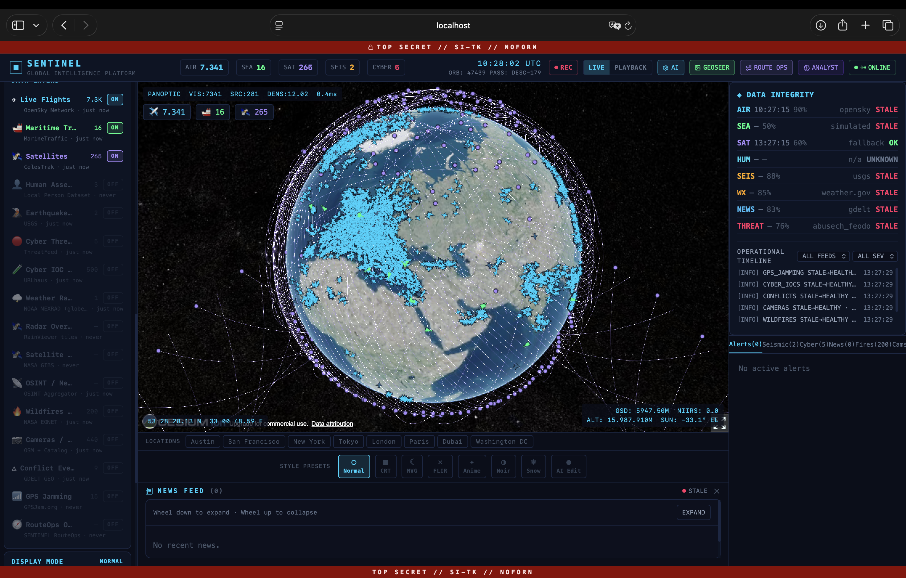
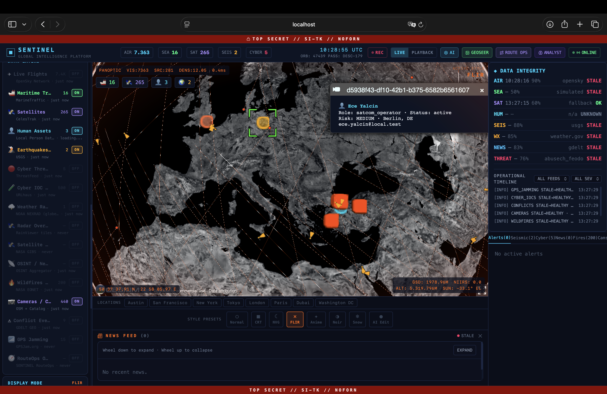
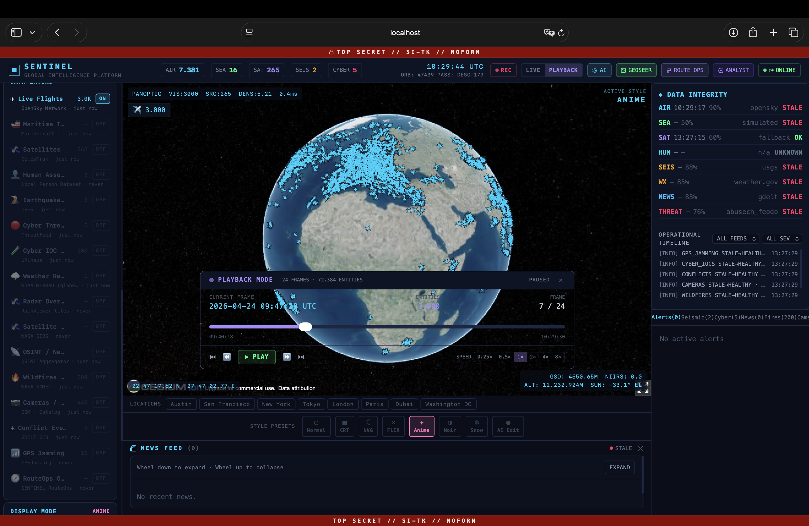
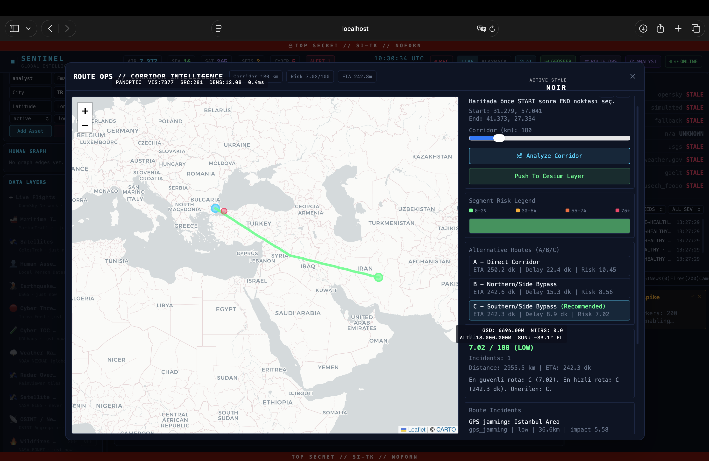
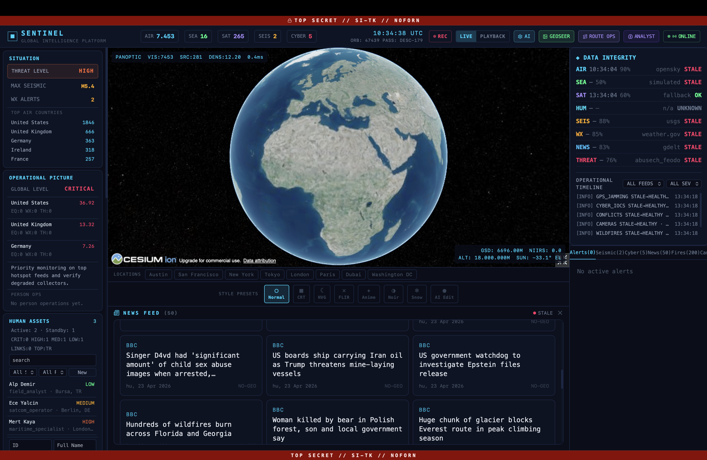
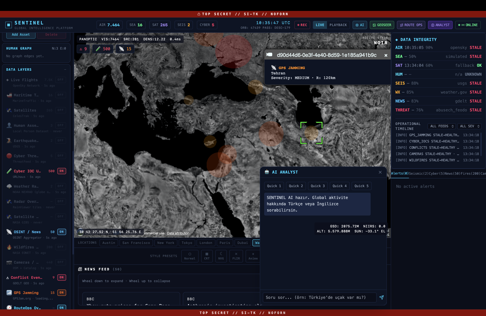

# 🛰️ SENTINEL — Real-Time OSINT Intelligence Platform

A full-stack, real-time global intelligence dashboard built with **CesiumJS**, **FastAPI**, **Redis**, and **React**. SENTINEL aggregates live data from 12+ open-source intelligence (OSINT) feeds and visualizes them on an interactive 3D globe.

---

## 📸 Screenshots

### 🌍 Live Globe — 7,000+ Aircraft + Satellites


### 🔴 FLIR Mode — Human Assets Tracking


### ▶️ Playback Mode — Historical Replay


### 🗺️ Route Ops — Corridor Intelligence


### 📰 News Feed — Live OSINT Dashboard


### 🌑 NOIR Mode — GPS Jamming + AI Chat


---

## 🌍 Live Data Sources

| Layer | Source | Count |
|-------|--------|-------|
| ✈️ Aircraft | OpenSky Network | ~7,000+ live |
| 🛸 Satellites | Celestrak / N2YO | ~265 |
| 🚢 Ships | AIS (simulated) | ~16 |
| 🔥 Wildfires | NASA EONET v3 | ~200 |
| 🌍 Earthquakes | USGS | real-time |
| 📰 News | BBC World RSS | ~50 |
| ⚔️ Conflicts | BBC World RSS | live |
| 🧪 Cyber IOCs | URLhaus | ~500 |
| 📷 Cameras | OpenStreetMap Overpass | ~440 |
| ⚡ GPS Jamming | Static OSINT | ~15 zones |
| 🌪️ Weather Alerts | weather.gov | real-time |
| 🛡️ Threat Intel | Feodo Tracker | live |

---

## 🚀 Features

- **3D Globe** — CesiumJS-powered interactive globe with real-time entity tracking
- **Playback System** — Record and replay historical position data
- **WebSocket** — Live data streaming with auto-reconnect
- **AI Integration** — Multi-provider support (Ollama, OpenAI, Anthropic, Gemini, Groq)
- **GeoSeer** — AI-powered geospatial analysis
- **Alert System** — Configurable threat alerts
- **Layer Controls** — Toggle individual data layers
- **Person Graph** — Entity relationship visualization
- **Route Ops** — Maritime/air route operations panel

---

## 🏗️ Tech Stack

**Backend**
- Python 3.12 / FastAPI
- Redis (caching & pub/sub)
- SQLite + SQLAlchemy (async)
- WebSocket (real-time streaming)
- Aiohttp (async OSINT collectors)

**Frontend**
- React 18 + Vite
- CesiumJS (3D globe)
- Zustand (state management)
- Tailwind CSS
- WebSocket client

---

## ⚙️ Setup

### Backend
```bash
cd backend
python -m venv .venv
source .venv/bin/activate
pip install -r requirements.txt
cp .env.example .env
uvicorn main:app --reload --port 8000
```

### Frontend
```bash
cd frontend
npm install
npm run dev
```

### Requirements
- Python 3.12+
- Node.js 18+
- Redis (running on localhost:6379)

---

## 🔑 Environment Variables

Create `backend/.env`:

```env
ANTHROPIC_API_KEY=
OPENAI_API_KEY=
GEMINI_API_KEY=
GROQ_API_KEY=
OLLAMA_URL=http://localhost:11434
OLLAMA_MODEL=llama3.1:8b
DATABASE_URL=sqlite+aiosqlite:///./sentinel.db
REDIS_URL=redis://localhost:6379
```

---

## 📄 License

Apache License 2.0 — see [LICENSE](LICENSE)
